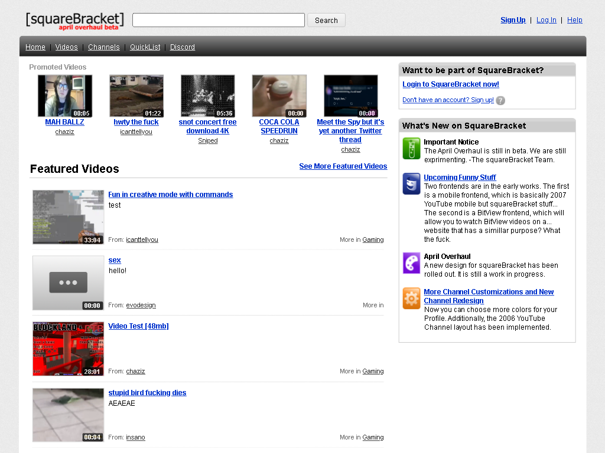

# PokTube


## How to set up (DEVELOPEMENT PURPOSES)

1. Get XAMPP.
2. Install Apache and MySQL from the XAMPP Control Panel.
3. Get ``poktube.sql`` from here
4. Make a database called ``poktube``
5. Import ``poktube.sql`` to the ``poktube`` database
6. Make a folder called ``preload`` in the content folder if it does not exist.

### The homer
Type these commands on your PokTube database on PHPmyAdmin, why? Because the database was updated. A fresh empty database is available.

No, this will not give access to that The Homer folder.
#### February 22nd 2021 database change
This adds the "Is admin" and the "Is approved" things, for the Admin Control Panel.
```sql
ALTER TABLE `users` ADD `is_admin` INT(4) NOT NULL DEFAULT '0' AFTER `is_partner`; 

ALTER TABLE `videodb` ADD `isApproved` INT(4) NOT NULL AFTER `UploadDate`; 
```
#### February 9th 2021 database changes
This adds Partner and HD Video Support. NEEDED OR ELSE UPLOADER WILL NOT WORK.
```sql
ALTER TABLE `users` ADD `is_partner` TINYINT NOT NULL AFTER `registeredon`; 

ALTER TABLE `videodb` ADD `HQVideoFile` TEXT NOT NULL AFTER `VideoFile`; 
```
#### February 22nd 2021 database changes
## To do
* Improve the All users page. (only some shitty internal incomplete admin control panel exists)
* Add categories